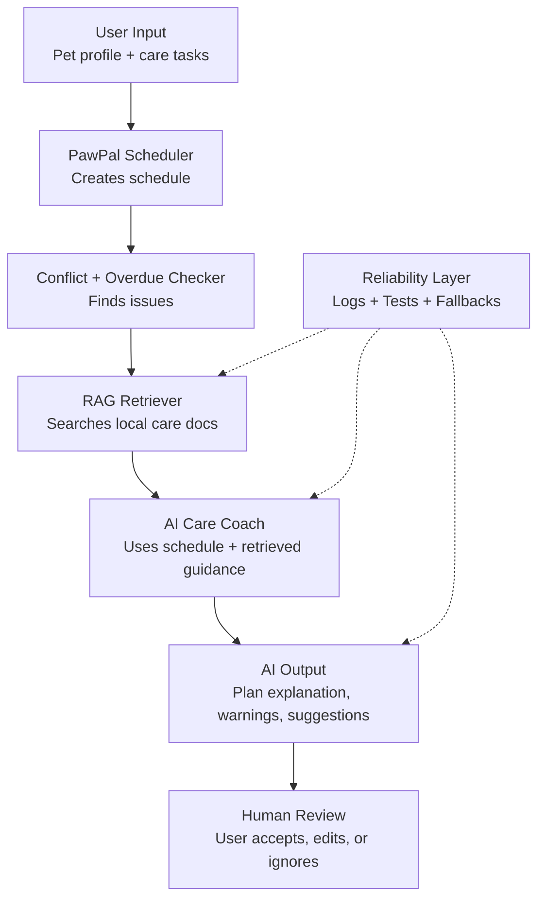

# 🐾 PawPal++ — AI-Powered Pet Care Planner

**Presentation & Demo:** [Watch the Loom video](https://www.loom.com/share/059b8bafd1d64966b45dc0dbd94059dc)

## Title & Summary

**PawPal++** is an AI-assisted pet care scheduling system that helps users plan, prioritize, and manage daily pet tasks. It combines rule-based scheduling with a Retrieval-Augmented Generation (RAG) system to provide intelligent explanations, safety warnings, and care recommendations.

The goal is not just to create a schedule, but to ensure that the schedule reflects **real pet-care best practices**, making it more reliable and useful in real-world scenarios.

---

## Original Project (Modules 1–3)

The original project, **PawPal+**, was a rule-based pet care planner built using Streamlit. It allowed users to:

* Create pets and assign care tasks (feeding, walking, medication, etc.)
* Automatically generate a daily schedule
* Detect conflicts and overdue tasks
* Provide basic summaries of the plan

The system focused on **correct scheduling logic**, but lacked domain knowledge about *how* pet care should be prioritized.

---

## What Changed (AI Extension)

PawPal++ introduces a **Retrieval-Augmented Generation (RAG) system**:

* The system retrieves relevant pet-care knowledge from local documents
* It uses that information to generate **context-aware advice**
* The AI explains *why* tasks are prioritized a certain way

This transforms PawPal from a scheduler into a **decision-support system**

---

## Architecture Overview



### Flow Explanation

1. User inputs pet info and tasks
2. Scheduler builds a plan and detects issues
3. RAG system retrieves relevant pet-care knowledge
4. AI generates explanations and recommendations
5. User reviews and adjusts the final schedule
6. Logging and tests ensure reliability

---

## Setup Instructions

### 1. Clone the repository

```bash
git clone https://github.com/rbhagat518/ai110-module2show-pawpal-starter.git
cd ai110-module2show-pawpal-starter
```

### 2. Install dependencies

```bash
pip install -r requirements.txt
```

### 3. Run the app

```bash
streamlit run app.py
```

### 4. Run tests (optional but recommended)

```bash
pytest
```

---

## Sample Interactions

### Example 1: Basic Schedule

**Input:**

* Pet: Dog (Buddy)
* Tasks: Feed (8am), Walk (9am), Medication (8:30am)

**Output:**

```
AI Care Coach:
Start with high-priority tasks such as feeding and medication.
Medication should not be delayed as it directly affects pet health.
Consider completing feeding before the walk for consistency.
```

---

### Example 2: Conflict Detection

**Input:**

* Tasks: Walk (9am), Grooming (9am)

**Output:**

```
AI Care Coach:
Resolve scheduling conflicts before proceeding.
Overlapping tasks may result in missed care.
Separate grooming and walking to ensure full attention.
```

---

### Example 3: Overdue Task

**Input:**

* Missed feeding task from earlier

**Output:**

```
AI Care Coach:
Prioritize overdue tasks immediately.
Delayed feeding can disrupt routine and health.
Adjust the schedule to prevent repeated delays.
```

---

## Design Decisions

### Why RAG?

* Adds **real-world knowledge** to a rule-based system
* Keeps the system **lightweight and explainable**
* Avoids reliance on external APIs for core functionality

### Why Local Knowledge Files?

* Deterministic and easy to debug
* Works offline
* Transparent retrieval process

### Trade-offs

| Decision                           | Trade-off                          |
| ---------------------------------- | ---------------------------------- |
| Local RAG instead of external APIs | Less powerful than full LLMs       |
| Rule-based retrieval               | Simpler but less semantically rich |
| No embeddings/vector DB            | Easier setup but less scalable     |

---

## ✅ Proving Reliability: Testing & Verification

PawPal+ doesn't just *claim* the RAG works—it **measures and verifies** reliability:

### 1. **Automated Tests** (`test_rag.py`)
17 pytest checks cover the RAG components: document loading, retrieval accuracy, confidence scoring, error handling, and consistency. The full suite currently has 32 tests across `test_rag.py` and `test_pawpal.py`.

**Run tests:**
```bash
pytest test_rag.py -v
```

### 2. **Confidence Scoring** (0-1 scale)
AI rates its own certainty based on:
- Document matches found in knowledge base
- Quality of matched sentences
- Overall aggregated confidence

Higher confidence = more knowledge-grounded responses

### 3. **Comprehensive Logging** (`pawpal_rag.log`)
Every RAG operation is tracked:
- Queries executed and timestamps
- Retrieval success rates
- Confidence scores for each retrieval
- Advice generation metrics
- Errors with full context

View logs in app via **"🧪 RAG Reliability & Testing"** tab

### 4. **Human Evaluation Interface**
Built-in Streamlit dashboard with:
- **Live Test Runner**: Run pytest tests directly in the app
- **Confidence Metrics**: See AI confidence for each decision
- **Log Monitoring**: View and download activity logs
- **Comparative Analysis**: Side-by-side basic vs. AI-enhanced output

### 5. **Fallback & Error Handling**
Gracefully handles failures:
- If retrieval fails: Returns generic advice instead of crashing
- If query doesn't match docs: Logs and attempts general advice
- All critical operations wrapped in try-catch blocks
- Errors logged with full context for debugging

---

## Testing Summary

The reliability check combines automated tests, confidence scoring, logging, and human review. Run `python3 -m pytest -q` to verify the scheduler and RAG behavior; the current suite passes with **32 tests**. The AI-enhanced scheduler returns an `overall_confidence` score from 0.0 to 1.0, records the exact retrieval queries used, and writes RAG activity/errors to `pawpal_rag.log` for review in the Streamlit reliability dashboard.

---

## Responsible AI Reflection

The system is limited by its small local knowledge base and simple keyword retrieval. It may miss advice when a user phrases a task differently, and it may over-prioritize the topics that are best represented in the markdown files, such as feeding and medication. It is also not a veterinarian, so its advice should support scheduling decisions, not diagnose illness or replace professional care.

The AI could be misused if someone treated its recommendations as medical instructions or ignored urgent symptoms because the schedule looked organized. To reduce that risk, PawPal++ keeps the deterministic scheduler separate from the AI advice, shows confidence scores, logs retrieval details, and uses human review as the final step. A stronger version should add clearer emergency warnings and direct users to a veterinarian for health concerns.

What surprised me while testing reliability was that the system could look helpful even when retrieval confidence was low. The tests made that visible by checking not only that advice text exists, but also that confidence scores, retrieval details, conflicts, and fallback behavior are exposed for review.

I collaborated with AI to extend the original scheduler into a RAG-based care coach. One helpful suggestion was to add confidence scoring and logging so the AI output could be inspected instead of just trusted. One flawed suggestion was assuming that the scheduler already returned confidence data to the app; testing showed that `overall_confidence` and `queries_executed` were generated internally but not exposed until I fixed the return value.

---

## Reflection

This project taught me that **AI systems are most valuable when they augment existing logic, not replace it**.

Instead of building a standalone chatbot, I integrated AI into a structured system where:

* deterministic logic handles scheduling
* AI adds context, explanation, and domain knowledge

I also learned that:

* RAG is a powerful way to ground AI outputs
* simple systems can still demonstrate meaningful AI behavior
* designing for reliability (tests, logs, fallback) is just as important as the AI itself

---
