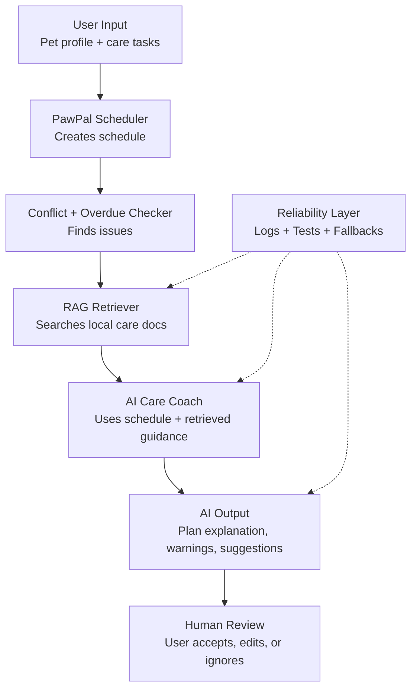

# 🐾 PawPal++ — AI-Powered Pet Care Planner

## Title & Summary

**PawPal++** is an AI-assisted pet care scheduling system that helps users plan, prioritize, and manage daily pet tasks. It combines rule-based scheduling with a Retrieval-Augmented Generation (RAG) system to provide intelligent explanations, safety warnings, and care recommendations.

The goal is not just to create a schedule, but to ensure that the schedule reflects **real pet-care best practices**, making it more reliable and useful in real-world scenarios.

---

## Original Project (Modules 1–3)

The original project, **PawPal+**, was a rule-based pet care planner built using Streamlit. It allowed users to:

* Create pets and assign care tasks (feeding, walking, medication, etc.)
* Automatically generate a daily schedule
* Detect conflicts and overdue tasks
* Provide basic summaries of the plan

The system focused on **correct scheduling logic**, but lacked domain knowledge about *how* pet care should be prioritized.

---

## What Changed (AI Extension)

PawPal++ introduces a **Retrieval-Augmented Generation (RAG) system**:

* The system retrieves relevant pet-care knowledge from local documents
* It uses that information to generate **context-aware advice**
* The AI explains *why* tasks are prioritized a certain way

This transforms PawPal from a scheduler into a **decision-support system**

---

## Architecture Overview



### Flow Explanation

1. User inputs pet info and tasks
2. Scheduler builds a plan and detects issues
3. RAG system retrieves relevant pet-care knowledge
4. AI generates explanations and recommendations
5. User reviews and adjusts the final schedule
6. Logging and tests ensure reliability

---

## Setup Instructions

### 1. Clone the repository

```bash
git clone https://github.com/rbhagat518/ai110-module2show-pawpal-starter.git
cd ai110-module2show-pawpal-starter
```

### 2. Install dependencies

```bash
pip install -r requirements.txt
```

### 3. Run the app

```bash
streamlit run app.py
```

### 4. Run tests (optional but recommended)

```bash
pytest
```

---

## Sample Interactions

### Example 1: Basic Schedule

**Input:**

* Pet: Dog (Buddy)
* Tasks: Feed (8am), Walk (9am), Medication (8:30am)

**Output:**

```
AI Care Coach:
Start with high-priority tasks such as feeding and medication.
Medication should not be delayed as it directly affects pet health.
Consider completing feeding before the walk for consistency.
```

---

### Example 2: Conflict Detection

**Input:**

* Tasks: Walk (9am), Grooming (9am)

**Output:**

```
AI Care Coach:
Resolve scheduling conflicts before proceeding.
Overlapping tasks may result in missed care.
Separate grooming and walking to ensure full attention.
```

---

### Example 3: Overdue Task

**Input:**

* Missed feeding task from earlier

**Output:**

```
AI Care Coach:
Prioritize overdue tasks immediately.
Delayed feeding can disrupt routine and health.
Adjust the schedule to prevent repeated delays.
```

---

## Design Decisions

### Why RAG?

* Adds **real-world knowledge** to a rule-based system
* Keeps the system **lightweight and explainable**
* Avoids reliance on external APIs for core functionality

### Why Local Knowledge Files?

* Deterministic and easy to debug
* Works offline
* Transparent retrieval process

### Trade-offs

| Decision                           | Trade-off                          |
| ---------------------------------- | ---------------------------------- |
| Local RAG instead of external APIs | Less powerful than full LLMs       |
| Rule-based retrieval               | Simpler but less semantically rich |
| No embeddings/vector DB            | Easier setup but less scalable     |

---

## Testing Summary
